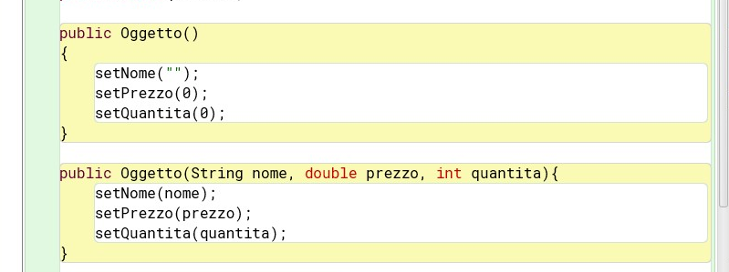
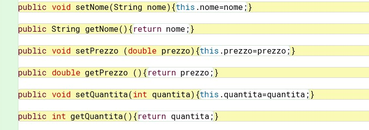
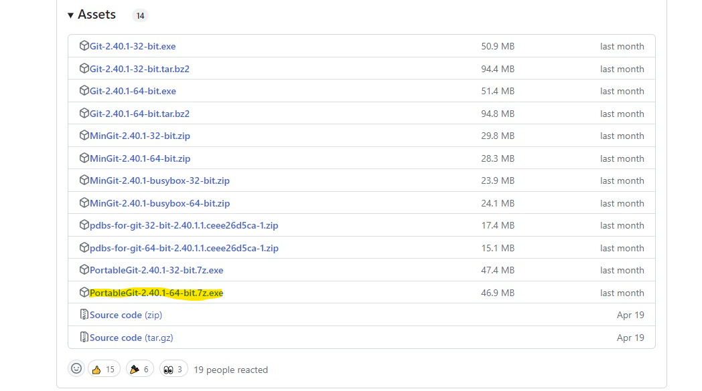
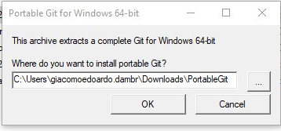
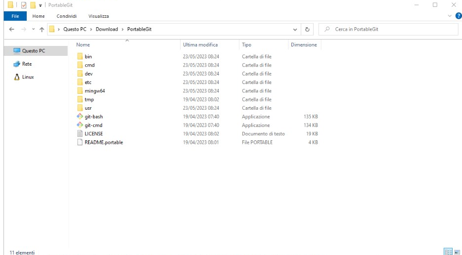
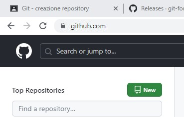
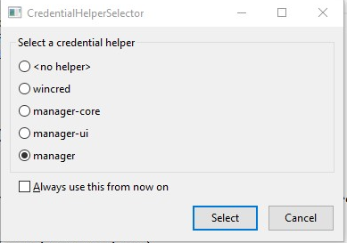

#GIT TUTORIAL


3.1

# Descrizione del codice caricato

## Classe Oggetto


### Metodi costruttori



### Set e Get



## Classe Inventario

Importare la librearia usando ` ` `import java.util.*;` ` `
In questa classe bisogna creare la ` ` `HashMap` ` `.

## Classe Test

In questa classe viene creato il ` ` `main ` ` `

## Classe Costanti

E' un'interfaccia dove viene creata una costante.

## Ulteriori classi

Nelle classi restanti bisogna creare le eccezioni.


3.2
# scaletta delle cose che ho fatto:

https://github.com/git-for-windows/git/releases/ -> link per scaricare github

ho scaricato git





eseguire il file exe scaricato





aprire git-bash nella cartella portable git





utilizzare il comando ` ` `cd $HOME/percorso della cartella/Verifica2305` ` `
il percorso della cartella deve essere deliminato da slash ```/``` ogni volta che si apre un percorso
fino ad arrivare alla carella richiesta.

non trovando il percorso della cartella utilizzare il comando "ls" che apre tutti i percorsi


## Creazione progetto


creare un repository su github

- Aprire il sito github.com
- Effettuare il login
- Cliccare su New in alto a sinistra





- Creare un repository chiamato Verifica2305, NON creare un README.md di default


## Configurazione del repository locale e sincronizzazione

Da ```git-bash``` eseguire i seguenti comandi:

```git init  # Inizializza il repository locale```

```git add README.md  # Inserimento del file README.md nell'area di staging```

```git add .``` per inserire tutti i file

```git commit -m "first commit"  # Creazione del primo commit, che serve a sincronizzare il repository locale con lo stage```

```git branch -M main  # Creazione del branch main, da usare come default```

```git remote add origin https://github.com/<username>/Verifica2305  # Connessione del repository remoto al repository locale```

```git push -u origin main  # Sincronizzazione del repository remoto con quello locale```


Nel caso in cui appaia questa finestra




selezionare ```manager-ui.```


Nel caso, invece, in cui il comando push non dovesse andare a buon fine a causa di problemi con
l'autenticazione, è stato configurato un account globale, pertanto bisogna eseguire questi passi:

- aprire il seguente link https://github.com/settings/tokens
- generare un token mediante ```Generate new token (classic)```
- confermare l'accesso inserendo la propria password, se richiesto
- in ```Note``` inserire un messaggio come "token di accesso"
- ```Expiration```: "No expiration"
- In ```Select scopes``` spuntare la casella accanto a ```repo```, in modo tale da avere la situazione sottostante
- generare il token e salvarlo in un file di testo


Dopodiché, eseguire nuovamente il comando push usando il seguente formato:

```git push https://<username>:<token>@github.com/<username>/<reponame>.git```
dove ```<username>``` è il vostro username, al posto di ```<token>``` bisogna inserire il token creato prima e ```<reponame>``` è il nome del repository sul quale si vuole effettuare il ```push``` (in questo caso, ```<reponame>``` è ```Git-tutorial).```


## Aggiunta di nuovi file al repository

1. Creare un nuovo file main.c nel workspace
2. Implementare un programma che, dati in input 10 numeri positivi, trovi il massimo e lo visualizzi a video
3. Aggiungere il nuovo file nell'area di staging
4. Sincronizzare l'area di staging con il repository locale (usando un messaggio di commit congruo)
5. Sincronizzare il repository remoto con quello locale

Per ognuno dei punti, effettuare, separatamente, i punti da 2 a 5 per sincronizzare i repository.

Di seguito vi sono delle istruzioni per migliorare la formattazione del file README.md

### NOTA: Il repository che creerete in questa esercitazione vi sarà utile per le prossime esercitazioni.

## Migioramento del file README.md

- Aggiungere la traccia dell'esercizio svolto
- Aggiungere una descrizione del codice
- Inserire una sezione in cui vengono spiegati i comandi utilizzati per la creazione di questo repository in stile tutorial
- Spiegare, in una nuova sezione, le funzioni base di Git


## Inserire immagini nel README.md
Aggiungere l'immagine img.jpg al progetto ed inserirla nel testo con il seguente comando: 


## Inserire sezioni
Le sezioni possono essere create inserendo un # prima del titolo della sezione. Si può modificare il tipo di sezione usando da uno a sei #. È importante separare i # dal titolo con uno spazio.

## Inserire codice e citazioni
Il codice può essere inserito delimitandolo con tre backtick `.

Le citazioni possono essere fatte aggiungendo > prima del testo.
